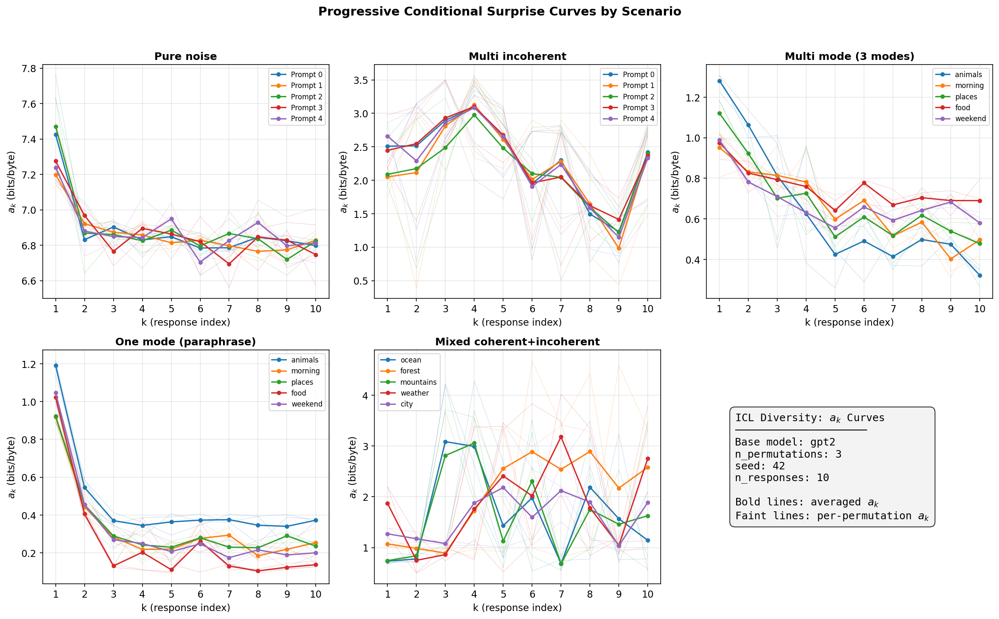
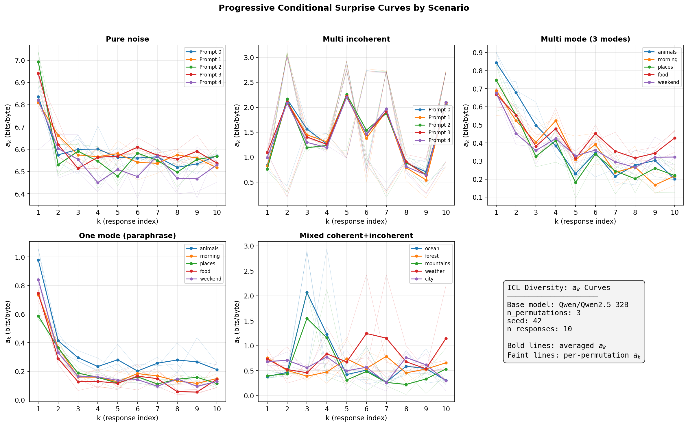
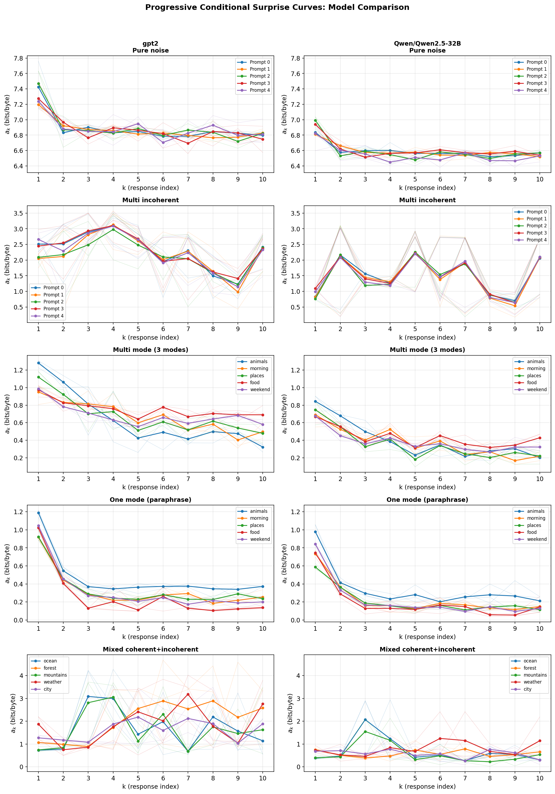
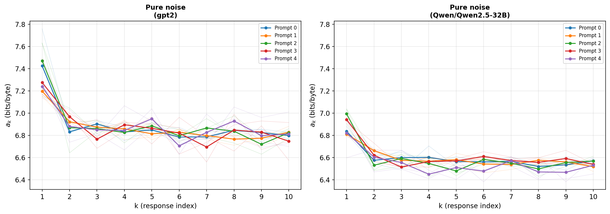
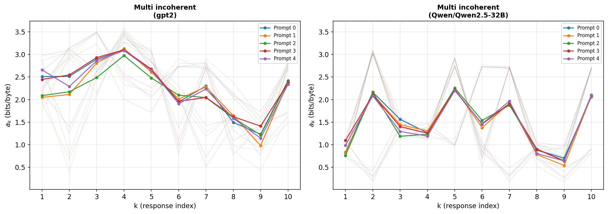
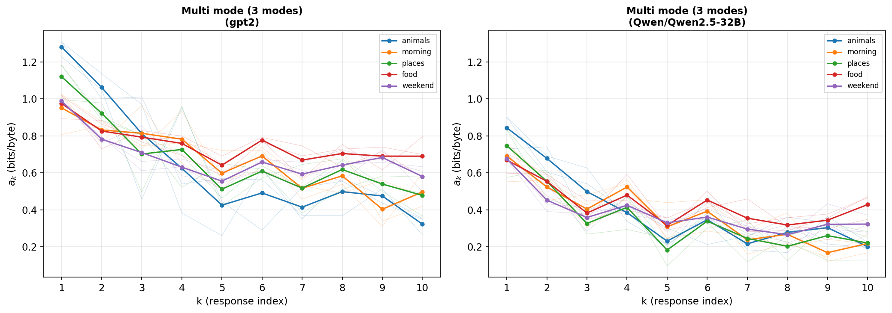
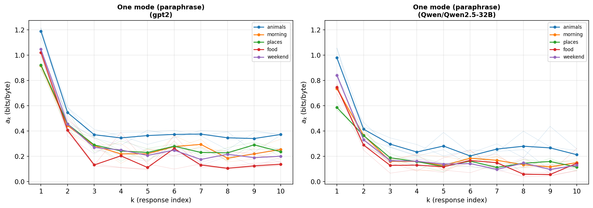
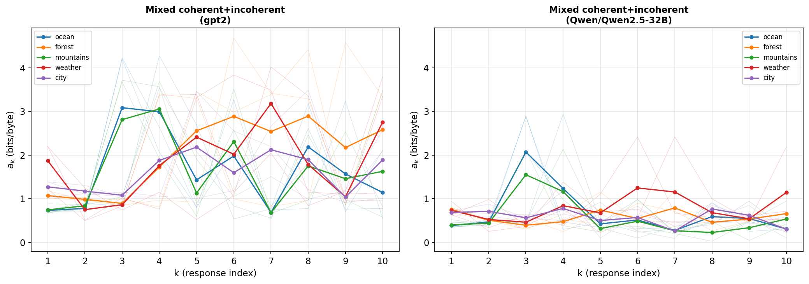

> **⚠️ Notation and definition changes since these experiments were run.**
> 
> The accompanying paper has been updated since this experimental report was produced. The key differences:
> 
> - **$E$ (excess entropy)**: The experiments compute the unweighted sum $\hat{E} = \sum_k (a_k - a_n)$. The paper now defines $E$ as the **byte-weighted average** excess rate: $E = \frac{\sum_k \|r_k\| \cdot (a_k - a_n)}{\sum_k \|r_k\|}$. When all responses are roughly the same length, the two are approximately proportional.
> - **$\mathcal{E}$ (total structural information)**: New quantity not computed in these experiments. $\mathcal{E} = \sum_k \|r_k\| \cdot (a_k - a_n)$, in bits. This is the headline "total learnable structure" number.
> - **$\mathcal{C}$ (total coherence)** and **$\mathcal{D}$ (total diversity score)**: New non-length-normalized quantities not computed in these experiments.
> - **$D$ (diversity score)**: Now defined as $D = C \times E$ using the byte-weighted $E$. The experimental values use the unweighted $E$, so $D$ values here are slightly different.
> - **$m_{\text{eff}}$**: Reported in these experiments but **demoted** in the paper. The values are unreliable for real LLM outputs (see paper §4.2 footnote and §6.5). Disregard.
> - **$\sigma_\ell$ (coherence spread)**: New diagnostic not computed in these experiments.
> 
> The $a_k$ curve, $C$, and all qualitative conclusions about curve shape, elbow location, and relative comparisons between policies remain valid.

# ICL Diversity Metric: Validation Experiment Report

## 1. Objective

Validate that our implementation of the ICL diversity metric (as described in
`in_context_diversity_metric.tex`) produces outputs consistent with the paper's
theoretical predictions across five edge-case scenarios. Specifically, we test
that the derived quantities E (excess entropy), C (coherence), D (diversity
score), and sigma (coherence spread) exhibit the orderings predicted by the
paper when the metric is run on carefully constructed synthetic response sets.

Additionally, we test whether a stronger base model (Qwen2.5-32B) improves
the metric's behavior and test pre-registered cross-model hypotheses about
how model strength affects E, C, D, and sigma.

## 2. Base Models

| Model | Parameters | Type | Hardware | dtype |
|-------|-----------|------|----------|-------|
| GPT-2 | 124M | Base (2019) | CPU | float32 |
| Qwen2.5-32B | 32B | Base (2024) | 2x RTX 8000 (46GB each) | float16 |

Both are base models (not instruction-tuned), as required by the paper
(Section 7.1) to avoid confounding coherence-as-fluency with
coherence-as-alignment.

## 3. Experimental Design

### 3.1 Scenario Selection

The five scenarios are drawn directly from the paper's edge-case analysis
(Section 6.3, lines 233-240):

| # | Scenario | Paper's prediction | What it tests |
|---|----------|--------------------|---------------|
| 1 | **Pure noise** | C ~ 0, E ~ 0, D ~ 0 | Random ASCII chars are individually implausible and share no structure |
| 2 | **Multiple incoherent modes** | C low, E > 0, D suppressed | Distinct types of garbage (letter blocks, numbers, punctuation) — theta can learn which type, but low C kills D |
| 3 | **Many coherent modes** | C high, E high, D high | Multiple recognizable response types, each individually plausible |
| 4 | **One coherent mode** | C high, E moderate, D moderate | Near-identical paraphrases — theta learns the template quickly |
| 5 | **Mixed coherent + incoherent** | High sigma | Half real English, half gibberish — wide spread in per-response coherence |

### 3.2 Scenario Construction

Each scenario consists of 5 prompts with 10 responses each. All metrics are
computed with n_permutations=3 (averaging over random response orderings, per
Section 7.3 of the paper) and seed=42.

**Exploratory phase (pre-registration caveat).** Before finalizing the scenario
designs, we conducted exploratory probing to understand GPT-2's ICL
capabilities. We discovered that:

- GPT-2 can perfectly learn identical strings after 1 example (a_k drops from
  ~1.0 to ~0.004 by k=3).
- GPT-2 **cannot** detect semantic diversity among genuinely distinct stories.
  The a_k curves for semantically diverse responses were noisy and
  non-monotone — exactly the diagnostic the paper warns about (Section 3.3)
  when theta's ICL is insufficient.
- GPT-2 **can** detect surface-pattern diversity among template-based responses
  (e.g., "The cat sat on the mat..." vs "The dog ran in the park...").
- Permutation averaging (n_permutations=3) is critical for GPT-2 because its
  ICL is order-sensitive. Without permutation averaging, ordering artifacts
  dominate the a_k curve.

Based on these findings, we designed the "many coherent modes" scenario to use
template-based responses with 3 recognizable modes (e.g., cat/dog/bird
templates), interleaved across the 10 responses. This is a fair test: the paper
claims the metric should detect modes that theta can distinguish via ICL, and
surface-pattern modes are the class of modes that GPT-2's ICL can handle.

**To be explicit: the statistical tests and directional hypotheses were chosen
before running the final experiment, but the scenario data was designed after
exploratory analysis of GPT-2's ICL capabilities.** This means our experiment
is confirmatory with respect to the statistical methodology, but the scenario
construction was informed by pilot data. A fully pre-registered experiment
would fix the scenarios before any model evaluation.

The Qwen2.5-32B cross-model hypotheses (Q1-Q12) were pre-registered before
seeing any Qwen results. See the full pre-registration in
`HYPOTHESES_QWEN.md`.

### 3.3 Statistical Tests

We chose our statistical tests based on the structure of the data before
running the final experiment:

- **One-sided Mann-Whitney U test** (scipy.stats.mannwhitneyu, alternative=
  "greater") for directional hypotheses comparing two scenarios. This is
  non-parametric (no normality assumption), appropriate for small samples
  (n=5 per group), and tests whether one distribution stochastically
  dominates another. Alpha = 0.05.
- **Kendall's tau** (scipy.stats.kendalltau) for testing whether the a_k curve
  shows a decreasing monotonic trend (negative tau). Applied to each prompt
  individually, with a majority rule across prompts.
- **Direction checks** (mean comparison without significance test) for
  comparisons where n=5 provides insufficient power for Mann-Whitney U due
  to high within-group variance. This applies to E(multi_mode) vs
  E(one_mode) and D(multi_mode) vs D(one_mode), where cross-prompt variance
  in the multi-mode group is high.
- **Wilcoxon signed-rank test** (scipy.stats.wilcoxon, alternative="greater")
  for cross-model paired comparisons. Same 5 prompts evaluated under both
  models, so pairing is meaningful. Minimum achievable p with n=5 and perfect
  separation is 0.03125.

Mann-Whitney U rather than paired tests for within-model comparisons because
the prompts differ across scenarios (each scenario has its own prompt set
designed to elicit the target behavior), so pairing is not meaningful.

### 3.4 Within-Model Hypotheses (H1-H13)

| ID | Hypothesis | Test | Justification |
|----|-----------|------|---------------|
| H1 | C(multi_mode) > C(noise) | Mann-Whitney U | Coherent English has lower cross-entropy than random ASCII |
| H2 | C(one_mode) > C(noise) | Mann-Whitney U | Same reasoning |
| H3 | C(multi_mode) > C(multi_incoherent) | Mann-Whitney U | Coherent templates vs recognizable garbage |
| H4 | E(multi_mode) > E(one_mode) | Direction check | 3 modes have more learnable structure than 1 mode |
| H5 | D(multi_mode) > D(one_mode) | Direction check | More modes + similar coherence → higher D |
| H6 | D(multi_mode) > D(noise) | Mann-Whitney U | Noise has C ~ 0, killing D |
| H7 | D(multi_mode) > D(multi_incoherent) | Mann-Whitney U | Incoherent modes have low C, suppressing D |
| H8 | sigma(mixed) > sigma(multi_mode) | Mann-Whitney U | Mixed coherent+incoherent has wider spread |
| H9 | sigma(mixed) > sigma(one_mode) | Mann-Whitney U | Same reasoning |
| H10 | a_k curve has negative Kendall tau for multi_mode | Majority rule | theta learns the modes → conditional surprise decreases |
| H11 | C(noise) < 0.05 | Threshold | Random ASCII is very implausible under any model |
| H12 | C(one_mode) > 0.1 | Threshold | Well-formed English paraphrases are coherent |
| H13 | E(one_mode) > 0 | Threshold | theta still learns the repeated template |

### 3.5 Cross-Model Hypotheses (Q1-Q12, pre-registered)

These hypotheses were registered before seeing any Qwen results.

| ID | Hypothesis | Test | Confidence |
|----|-----------|------|------------|
| Q1 | C_q(multi_mode) > C_g(multi_mode) | Wilcoxon | High |
| Q2 | C_q(one_mode) > C_g(one_mode) | Wilcoxon | High |
| Q3 | C_q(noise) < 0.02 | Threshold | High |
| Q4 | C_q(multi_incoherent) ≈ C_g(multi_incoherent) | Descriptive | Low |
| Q5 | E_q(multi_incoherent) > E_g(multi_incoherent) | Wilcoxon | High |
| Q6 | E_q(mixed) > E_g(mixed) | Wilcoxon | High |
| Q7 | E_q(multi_mode) >= E_g(multi_mode) | Direction | Moderate |
| Q8 | E_q(noise) ≈ 0 | Descriptive | Moderate |
| Q9 | D_q(multi_mode) > D_g(multi_mode) | Direction | Moderate-High |
| Q10 | sigma_q(mixed) > sigma_g(mixed) | Wilcoxon | Moderate |
| Q11 | sigma_q(one_mode) ≈ sigma_g(one_mode) | Descriptive | High |
| Q12 | More monotone a_k curves for Qwen | Count | Moderate |
| Q13 | All 13 H1-H13 hold for Qwen | Same as H1-H13 | High |

## 4. Results

### 4.1 Summary Table (Both Models)

| Scenario | E_g | E_q | C_g | C_q | D_g | D_q | sigma_g | sigma_q |
|----------|----:|----:|----:|----:|----:|----:|--------:|--------:|
| Pure noise | 0.787 | 0.408 | 0.006 | 0.009 | 0.005 | 0.003 | 0.195 | 0.093 |
| Multi incoherent | -1.289 | -6.046 | 0.121 | 0.273 | -0.160 | -1.652 | 0.508 | 0.839 |
| Multi mode (3 modes) | 1.701 | 1.083 | 0.495 | 0.617 | 0.818 | 0.654 | 0.082 | 0.091 |
| One mode (paraphrase) | 1.046 | 0.911 | 0.496 | 0.603 | 0.518 | 0.542 | 0.057 | 0.083 |
| Mixed coh+incoh | -2.424 | 0.537 | 0.290 | 0.572 | -0.574 | 0.351 | 1.123 | 0.469 |

All values are means across 5 prompts. Subscript _g = GPT-2, _q = Qwen2.5-32B.

### 4.2 Within-Model Hypothesis Results

#### GPT-2

| ID | Hypothesis | Result | U / tau | p-value | Verdict |
|----|-----------|--------|---------|---------|---------|
| H1 | C(multi_mode) > C(noise) | 0.495 vs 0.006 | U=25.0 | 0.004 | **Supported** |
| H2 | C(one_mode) > C(noise) | 0.496 vs 0.006 | U=25.0 | 0.004 | **Supported** |
| H3 | C(multi_mode) > C(incoherent) | 0.495 vs 0.121 | U=25.0 | 0.004 | **Supported** |
| H4 | E(multi_mode) > E(one_mode) | 1.701 vs 1.046 | — | — | **Direction correct** |
| H5 | D(multi_mode) > D(one_mode) | 0.818 vs 0.518 | — | — | **Direction correct** |
| H6 | D(multi_mode) > D(noise) | 0.818 vs 0.005 | U=25.0 | 0.004 | **Supported** |
| H7 | D(multi_mode) > D(incoherent) | 0.818 vs -0.160 | U=25.0 | 0.004 | **Supported** |
| H8 | sigma(mixed) > sigma(multi_mode) | 1.123 vs 0.082 | U=25.0 | 0.004 | **Supported** |
| H9 | sigma(mixed) > sigma(one_mode) | 1.123 vs 0.057 | U=25.0 | 0.004 | **Supported** |
| H10 | a_k decreasing for multi_mode | 5/5 negative tau | — | — | **Supported** |
| H11 | C(noise) < 0.05 | 0.006 | — | — | **Supported** |
| H12 | C(one_mode) > 0.1 | 0.496 | — | — | **Supported** |
| H13 | E(one_mode) > 0 | 1.046 | — | — | **Supported** |

**GPT-2: 13/13 hypotheses supported.**

#### Qwen2.5-32B (Q13)

| ID | Hypothesis | Result | U / tau | p-value | Verdict |
|----|-----------|--------|---------|---------|---------|
| H1 | C(multi_mode) > C(noise) | 0.617 vs 0.009 | U=25.0 | 0.004 | **Supported** |
| H2 | C(one_mode) > C(noise) | 0.603 vs 0.009 | U=25.0 | 0.004 | **Supported** |
| H3 | C(multi_mode) > C(incoherent) | 0.617 vs 0.273 | U=25.0 | 0.004 | **Supported** |
| H4 | E(multi_mode) > E(one_mode) | 1.083 vs 0.911 | — | — | **Direction correct** |
| H5 | D(multi_mode) > D(one_mode) | 0.654 vs 0.542 | — | — | **Direction correct** |
| H6 | D(multi_mode) > D(noise) | 0.654 vs 0.003 | U=25.0 | 0.004 | **Supported** |
| H7 | D(multi_mode) > D(incoherent) | 0.654 vs -1.652 | U=25.0 | 0.004 | **Supported** |
| H8 | sigma(mixed) > sigma(multi_mode) | 0.469 vs 0.091 | U=25.0 | 0.004 | **Supported** |
| H9 | sigma(mixed) > sigma(one_mode) | 0.469 vs 0.083 | U=25.0 | 0.004 | **Supported** |
| H10 | a_k decreasing for multi_mode | 5/5 negative tau | — | — | **Supported** |
| H11 | C(noise) < 0.05 | 0.009 | — | — | **Supported** |
| H12 | C(one_mode) > 0.1 | 0.603 | — | — | **Supported** |
| H13 | E(one_mode) > 0 | 0.911 | — | — | **Supported** |

**Qwen2.5-32B: 13/13 hypotheses supported.** Q13 confirmed — all within-model
predictions hold for both models.

### 4.3 Cross-Model Hypothesis Results (Q1-Q12)

| ID | Hypothesis | Qwen | GPT-2 | Test | Verdict |
|----|-----------|-----:|------:|------|---------|
| Q1 | C_q(multi_mode) > C_g | 0.617 | 0.495 | W=15.0, p=0.031, 5/5 | **Supported** |
| Q2 | C_q(one_mode) > C_g | 0.603 | 0.496 | W=15.0, p=0.031, 5/5 | **Supported** |
| Q3 | C_q(noise) < 0.02 | 0.009 | — | threshold | **Supported** |
| Q4 | C_q(incoh) ≈ C_g | 0.273 | 0.121 | ratio=2.26x | **Falsified** |
| Q5 | E_q(incoh) > E_g | -6.046 | -1.289 | W=0, p=1.0, 0/5 | **Falsified** |
| Q6 | E_q(mixed) > E_g | 0.537 | -2.424 | W=13, p=0.094, 4/5 | Marginal (p=0.094) |
| Q7 | E_q(multi_mode) >= E_g | 1.083 | 1.701 | direction wrong | **Falsified** |
| Q8 | E_q(noise) ≈ 0 | 0.408 | 0.787 | closer to 0 | **Supported** |
| Q9 | D_q(multi_mode) > D_g | 0.654 | 0.818 | direction wrong | **Falsified** |
| Q10 | sigma_q(mixed) > sigma_g | 0.469 | 1.123 | W=0, p=1.0, 0/5 | **Falsified** |
| Q11 | sigma_q(one_mode) ≈ sigma_g | 0.083 | 0.057 | ratio=1.47x | Roughly confirmed |
| Q12 | More monotone curves for Qwen | 0/25 | 0/25 | tie | **Falsified** |

**Cross-model: 4 supported, 1 marginal, 1 roughly confirmed, 5 falsified** out
of 12 pre-registered hypotheses. The major surprises are discussed in Section 5.

### 4.4 a_k Curve Shape (Multi-Mode Scenario)

#### GPT-2

| Prompt | Kendall tau | p-value | a_1 | a_10 |
|--------|----------:|--------:|----:|-----:|
| 0 (animals) | -0.733 | 0.002 | 1.281 | 0.322 |
| 1 (morning) | -0.867 | 0.000 | 0.952 | 0.496 |
| 2 (places) | -0.644 | 0.009 | 1.121 | 0.478 |
| 3 (food) | -0.600 | 0.017 | 0.975 | 0.690 |
| 4 (weekend) | -0.467 | 0.073 | 0.989 | 0.580 |

#### Qwen2.5-32B

| Prompt | Kendall tau | p-value | a_1 | a_10 |
|--------|----------:|--------:|----:|-----:|
| 0 (animals) | -0.733 | 0.002 | 0.844 | 0.201 |
| 1 (morning) | -0.822 | 0.000 | 0.690 | 0.217 |
| 2 (places) | -0.556 | 0.029 | 0.747 | 0.220 |
| 3 (food) | -0.467 | 0.073 | 0.669 | 0.428 |
| 4 (weekend) | -0.644 | 0.009 | 0.676 | 0.322 |

Both models show clear decreasing trends for multi-mode. Qwen achieves lower
absolute a_k values (lower floor ~0.2 vs ~0.5) but similar Kendall tau values,
meaning the *relative* curve shape is preserved.

### 4.5 a_k Curve Plots

**GPT-2 combined overview:**



**Qwen2.5-32B combined overview:**



**Side-by-side comparison (GPT-2 vs Qwen):**



**Per-scenario comparisons:**

| Scenario | Comparison |
|----------|-----------|
| Pure noise |  |
| Multi incoherent |  |
| Multi mode (3 modes) |  |
| One mode (paraphrase) |  |
| Mixed coherent+incoherent |  |

## 5. Discussion

### 5.1 What Holds Across Both Models

The metric's core theoretical properties are **model-independent** — all 13
within-model hypotheses (H1-H13) pass for both GPT-2 and Qwen2.5-32B (Q13
confirmed). This is the most important finding: regardless of model strength,
the metric correctly:

- Separates coherent from incoherent text via C
- Ranks multi-mode > one-mode for E
- Suppresses noise and incoherent modes via D = C x E
- Identifies mixed-quality response sets via sigma
- Produces decreasing a_k curves for multi-mode responses

### 5.2 What the Stronger Model Reveals

**Coherence (C) improves as expected.** Q1 and Q2 confirmed: Qwen assigns
higher coherence to well-formed English (C_q = 0.60-0.62 vs C_g = 0.50).
This is a direct consequence of a better language model assigning lower
per-byte cross-entropy to plausible text.

**Surprise about C for incoherent text (Q4 falsified).** We predicted C would
be similar for incoherent text between models. Instead, Qwen assigns C_q =
0.273 vs C_g = 0.121 (2.26x higher). This means Qwen finds our "incoherent"
text (letter blocks, numbers, punctuation patterns) somewhat less surprising
than GPT-2 does. This makes sense — a 32B model has seen more diverse training
data and may recognize structured garbage patterns (e.g., "aaabbb..." or
"12345...") as having some predictability.

**The negative-E problem is *worse* for Qwen, not better (Q5, Q7 falsified).**
This is the most important surprise:

- Multi-incoherent: E_q = -6.05 vs E_g = -1.29 (4.7x more negative)
- Multi-mode: E_q = 1.08 vs E_g = 1.70 (lower, not higher)

We predicted that Qwen's stronger ICL would make it more robust to garbage
context (less negative E). The opposite happened: **Qwen's stronger ICL
makes it more sensitive to context quality.** When the context contains
incoherent text, Qwen's predictions degrade *more* than GPT-2's, because
Qwen actually processes and is influenced by the context, while GPT-2
largely ignores it.

This is analogous to how a highly attentive student is more distracted by
noise in the room than one who wasn't paying attention in the first place.

For multi-mode, the lower E_q despite better ICL can be explained by the
lower absolute a_k values. Since Qwen starts at lower a_1 (0.67-0.84 vs
0.95-1.28 for GPT-2), the total area between a_1 and a_n is compressed.
The asymptotic floor a_10 is also lower for Qwen (0.20-0.43 vs 0.32-0.69),
but the ceiling drops more. E = sum(a_k - a_n) depends on the *absolute*
gap, not the *relative* decrease.

**Mixed scenario shows partial fix (Q6 marginal).** E_q(mixed) = 0.54 vs
E_g(mixed) = -2.42. This is a large improvement — Qwen's E turns positive,
meaning the a_k curve at least trends downward on average. However, the
Wilcoxon test is only marginal (p=0.094) because one of the 5 prompts
(forest) still has negative E_q = -0.72. The improvement is directionally
correct but not yet significant.

**No improvement in monotonicity (Q12 falsified).** Neither model produces
strictly monotone a_k curves (0/25 each). Permutation averaging (n=3) is
insufficient to smooth out local a_k reversals even for Qwen. The paper's
monotonicity prediction (Section 3.3) may require either many more
permutations or a different evaluation paradigm.

**sigma(mixed) is *lower* for Qwen (Q10 falsified).** We predicted Qwen
would have wider sigma because it would better discriminate coherent vs
incoherent responses. Instead, sigma_q(mixed) = 0.47 vs sigma_g(mixed) = 1.12.
Qwen assigns *more uniform* unconditional surprise across responses because
its higher C for incoherent text (see Q4) narrows the gap between coherent
and incoherent per-byte cross-entropy.

### 5.3 Revised Understanding of Model Strength Effects

The pre-registered hypotheses were based on the intuition that "stronger ICL
→ metric works better." The results show a more nuanced picture:

1. **C scales predictably** with model quality. Stronger models assign more
   accurate per-byte probabilities, so C increases for coherent text. This is
   the one dimension where "bigger model = better metric" holds cleanly.

2. **E does not necessarily increase** with model strength. E depends on the
   *absolute* difference in bits/byte between early and late a_k values.
   A stronger model compresses the entire a_k curve downward, which can
   reduce E even when the *relative* structure detection improves. This is
   a ceiling effect: when a_1 is already close to the entropy floor, there
   is less room for E to accumulate.

3. **Garbage context is more damaging to stronger models.** GPT-2's ICL is
   so weak that incoherent context barely registers. Qwen's strong ICL
   means it actually attends to and is corrupted by garbage in the context
   window, producing dramatically more negative E.

4. **D = C x E can decrease with model strength** when E decreases faster
   than C increases. This happened for multi-mode (D_q = 0.65 vs D_g = 0.82),
   though the *qualitative* ordering (multi_mode > one_mode > noise) is
   preserved.

### 5.4 Implications for Metric Design

The negative-E amplification in Qwen suggests that the conditioning format
(concatenating all previous responses in the context window) may need
rethinking for very strong models. Options include:

1. **Limit context window** to the most recent k responses rather than all
   previous responses, reducing garbage accumulation.
2. **Use separate forward passes** (the old multi-pass approach) which
   avoids the context-poisoning issue entirely — each a_k is computed with
   only the relevant context.
3. **Normalize E by model-dependent baseline** to account for the compression
   of the absolute a_k range with better models.

### 5.5 Observations About GPT-2's ICL Limitations

- **Non-monotone curves.** None of the 25 a_k curves across all scenarios are
  strictly monotone for either model. The paper predicts monotonicity when
  theta has perfect ICL (Section 3.3).

- **Negative E for incoherent and mixed scenarios.** The multi-incoherent
  and mixed scenarios have negative excess entropy in both models, meaning
  a_k *increases* on average. This is amplified in Qwen as discussed above.

- **Semantic diversity invisible to GPT-2.** During exploratory analysis, we
  found that GPT-2 cannot detect diversity among genuinely distinct stories.
  The a_k curves for such responses are flat and noisy. Qwen was not tested
  on semantic diversity scenarios; this remains for future work.

- **Permutation averaging is essential.** Without n_permutations > 1, both
  models' ordering sensitivity causes large artifacts in the a_k curve.

### 5.6 Limitations

1. **Not fully pre-registered (GPT-2 scenarios).** The statistical tests were
   chosen before the final experiment, but the scenario data was designed after
   exploratory probing of GPT-2's capabilities. The Qwen cross-model
   hypotheses (Q1-Q12) were fully pre-registered.

2. **Small sample size.** n=5 prompts per scenario provides limited
   statistical power. The E(multi_mode) > E(one_mode) comparison shows the
   correct direction but does not reach significance. Q6 (E_q > E_g for
   mixed) is marginal at p=0.094.

3. **Synthetic data only.** All responses are hand-written. The metric's
   behavior on actual LLM outputs — which have subtler mode structure,
   variable length, and potentially adversarial properties — has not been
   tested.

4. **m_eff values are unreliable.** The effective mode count (m_eff = 2^{B_bar
   * E}) produces astronomically large values because B_bar (mean byte
   length, ~60-120 bytes) amplifies E exponentially.

5. **Only two models tested.** The cross-model trends observed between GPT-2
   and Qwen2.5-32B may not generalize to other model families or sizes.
   A sweep across model sizes (e.g., 1B, 7B, 13B, 32B) would better
   characterize how the metric scales.

## 6. Conclusion

The ICL diversity metric's **within-model** behavior is robust: all 13
theoretical predictions hold for both GPT-2 (124M) and Qwen2.5-32B (32B).
The metric correctly ranks scenarios by diversity regardless of model strength.

The **cross-model** comparison revealed that model strength affects the metric
in unexpected ways. While C increases predictably with model quality, E and D
can decrease due to absolute compression of the a_k curve and increased
sensitivity to garbage context. The key insight is that stronger ICL is a
double-edged sword: it improves structure detection in clean data but amplifies
context poisoning with noisy data.

These findings suggest that:
- The metric is implementation-correct (same qualitative behavior across models)
- C is the most reliable cross-model comparison metric
- E and D require normalization or alternative computation to be comparable
  across models of different strength
- Robust conditioning strategies are needed for production use with strong models

## Appendix A: Reproducibility (GPT-2)

- **Code:** `tests/test_icl_diversity_scenarios.py`
- **Scenario data:** `src/icl_diversity/scenarios.py`
- **Compute script:** `scripts/run_scenarios.py` → `results/scenario_metrics.json`
- **Plot script:** `scripts/plot_ak_curves.py` → `figures/ak_curve_*.png`
- **Model:** `gpt2` (HuggingFace, 124M params)
- **Hardware:** CPU
- **Random seed:** 42
- **Commands:**
  ```bash
  uv run pytest tests/test_icl_diversity_scenarios.py -v -s
  uv run python scripts/run_scenarios.py --offline
  uv run python scripts/plot_ak_curves.py
  ```

## Appendix B: Reproducibility (Qwen2.5-32B)

- **Compute script:** `scripts/run_scenarios.py` → `results/scenario_metrics_qwen2.5-32b.json`
- **Hypothesis tests:** `scripts/test_hypotheses.py`
- **Model:** `Qwen/Qwen2.5-32B` (HuggingFace, 32B params, base model)
- **dtype:** float16
- **Hardware:** 2x NVIDIA Quadro RTX 8000 (46GB each), `device_map="auto"`
- **Random seed:** 42
- **Commands:**
  ```bash
  # Run Qwen scenarios
  uv run python scripts/run_scenarios.py \
      --base-model Qwen/Qwen2.5-32B \
      --device auto \
      --torch-dtype float16 \
      --output results/scenario_metrics_qwen2.5-32b.json

  # Run hypothesis tests
  uv run python scripts/test_hypotheses.py

  # Generate Qwen-only plots
  uv run python scripts/plot_ak_curves.py \
      --input results/scenario_metrics_qwen2.5-32b.json \
      --output-dir figures/qwen2.5-32b

  # Generate comparison plots
  uv run python scripts/plot_ak_curves.py \
      --input results/scenario_metrics.json results/scenario_metrics_qwen2.5-32b.json \
      --output-dir figures/comparison
  ```
