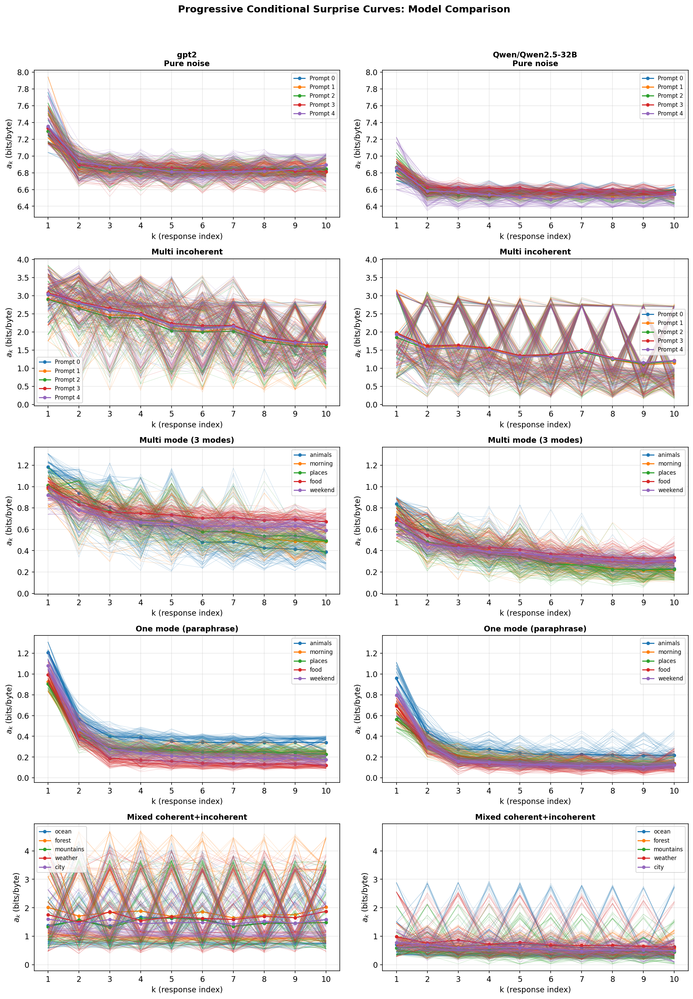
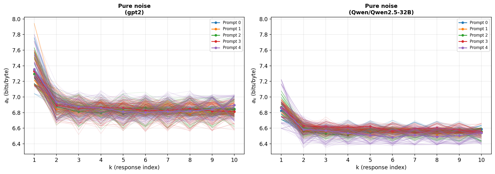
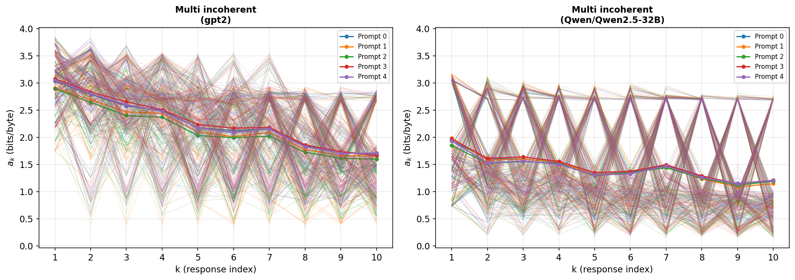
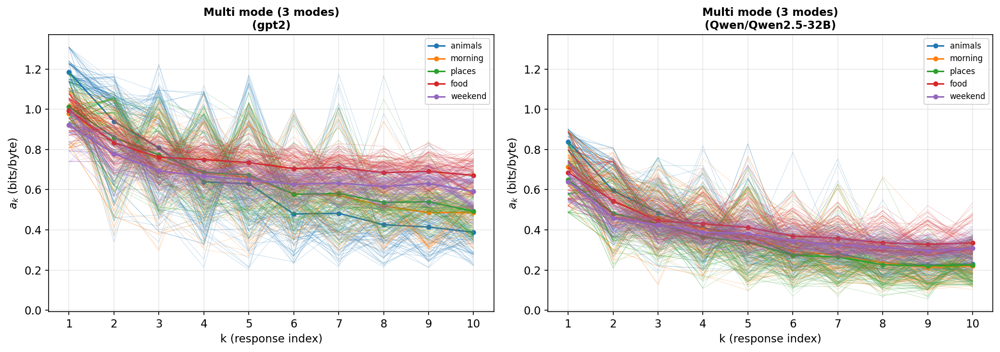
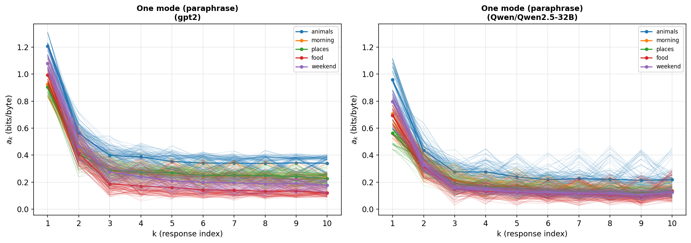
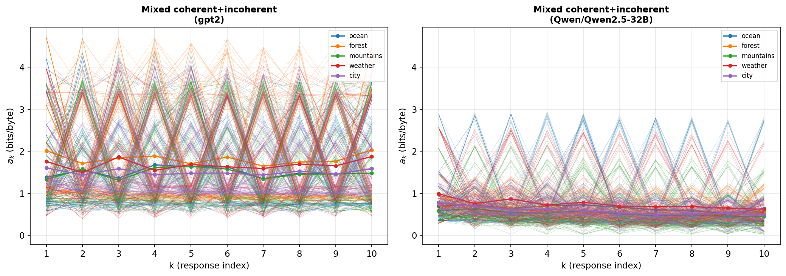

# ICL Diversity Metric V2: Validation Experiment Report

## 1. Objective

Re-validate the ICL diversity metric after migrating to the revised paper
definitions. The key changes from V1:

- **a_k curve now in total bits** (not bits/byte)
- **E (excess entropy)** = sum(a_k - a_n) in total bits
- **E_rate** = per-byte excess entropy rate (Option B normalization:
  normalize per-response per-permutation before averaging)
- **C_total** = 2^{mean(log2(P(r_i|p)))} — geometric mean of total
  response probabilities
- **D = C * E_rate** (changed from C * E)
- **D_total = C_total * E** — new primary diversity scalar
- **m_eff removed** entirely

We run each model at two permutation levels (3 and 100) to assess
permutation sensitivity, which was flagged as a major concern in V1.

## 2. Base Models

| Model | Parameters | Type | Hardware | dtype |
|-------|-----------|------|----------|-------|
| GPT-2 | 124M | Base (2019) | GPU (RTX 8000) | float32 |
| Qwen2.5-32B | 32B | Base (2024) | 2x RTX 8000 (46GB each) | float16 |

## 3. Experimental Design

Same 5 scenarios as V1, each with 5 prompts and 10 responses. Four runs:

| Run | Model | n_permutations | Result file |
|-----|-------|----------------|-------------|
| 1 | GPT-2 | 3 | `results/scenario_metrics_v2_3perm.json` |
| 2 | GPT-2 | 100 | `results/scenario_metrics_v2_100perm.json` |
| 3 | Qwen2.5-32B | 3 | `results/scenario_metrics_v2_qwen_3perm.json` |
| 4 | Qwen2.5-32B | 100 | `results/scenario_metrics_v2_qwen_100perm.json` |

Seed=42 for all runs. Computation uses the single-pass forward approach
(one forward pass per permutation).

## 4. Results

### 4.1 Summary Table (100 Permutations)

Mean across 5 prompts per scenario. Subscript _g = GPT-2, _q = Qwen2.5-32B.

| Scenario | E_rate_g | E_rate_q | C_g | C_q | D_g | D_q | sigma_g | sigma_q |
|----------|--------:|--------:|----:|----:|----:|----:|--------:|--------:|
| Pure noise | 0.55 | 0.44 | 0.006 | 0.009 | 0.003 | 0.004 | 0.195 | 0.093 |
| Multi incoherent | 5.64 | 2.42 | 0.121 | 0.273 | 0.681 | 0.659 | 0.508 | 0.839 |
| Multi mode | 1.55 | 1.22 | 0.495 | 0.617 | 0.748 | 0.742 | 0.082 | 0.091 |
| One mode | 1.24 | 0.85 | 0.496 | 0.603 | 0.610 | 0.507 | 0.057 | 0.083 |
| Mixed | -1.27 | 0.69 | 0.290 | 0.572 | -0.337 | 0.386 | 1.123 | 0.469 |

### 4.2 New Quantities: E (total bits) and C_total

| Scenario | E_g (bits) | E_q (bits) | log2(C_total)_g | log2(C_total)_q |
|----------|----------:|----------:|----------------:|----------------:|
| Pure noise | 49.7 | 39.3 | -580.4 | -541.4 |
| Multi incoherent | 359.8 | 156.4 | -190.2 | -116.5 |
| Multi mode | 159.4 | 126.2 | -107.6 | -73.7 |
| One mode | 118.6 | 80.5 | -96.7 | -69.5 |
| Mixed | -52.0 | 54.8 | -121.8 | -57.1 |

**C_total is astronomically small** for all scenarios (e.g., 2^{-580} for
noise). This makes D_total = C_total * E effectively zero everywhere.
C_total in its current form is not a useful metric for these response lengths
(~50-100 bytes each). The geometric mean of total response probabilities
underflows for any non-trivial text.

### 4.3 Within-Model Hypothesis Results (100 Permutations)

#### GPT-2 (H1-H13)

Using E_rate and D = C * E_rate (the revised definitions):

| ID | Hypothesis | Result | Verdict |
|----|-----------|--------|---------|
| H1 | C(multi_mode) > C(noise) | 0.495 vs 0.006, p=0.004 | **Supported** |
| H2 | C(one_mode) > C(noise) | 0.496 vs 0.006, p=0.004 | **Supported** |
| H3 | C(multi_mode) > C(incoherent) | 0.495 vs 0.121, p=0.004 | **Supported** |
| H4 | E(multi_mode) > E(one_mode) | 159.4 vs 118.6 bits | **Direction correct** |
| H5 | D(multi_mode) > D(one_mode) | 0.748 vs 0.610 | **Direction correct** |
| H6 | D(multi_mode) > D(noise) | 0.748 vs 0.003, p=0.004 | **Supported** |
| H7 | D(multi_mode) > D(incoherent) | 0.748 vs 0.681, p=0.345 | **Failed** |
| H8 | sigma(mixed) > sigma(multi_mode) | 1.123 vs 0.082, p=0.004 | **Supported** |
| H9 | sigma(mixed) > sigma(one_mode) | 1.123 vs 0.057, p=0.004 | **Supported** |
| H10 | a_k decreasing for multi_mode | 5/5 negative tau | **Supported** |
| H11 | C(noise) < 0.05 | 0.006 | **Supported** |
| H12 | C(one_mode) > 0.1 | 0.496 | **Supported** |
| H13 | E(one_mode) > 0 | 118.6 bits | **Supported** |

**GPT-2 at 100 perms: 12/13 supported.** H7 (D(multi_mode) > D(incoherent))
now fails because at 100 permutations, multi_incoherent's E_rate jumps from
-1.29 to +5.64, making D_incoherent (0.681) approach D_multi_mode (0.748).

#### Qwen2.5-32B (Q13)

| ID | Hypothesis | 3 perms | 100 perms |
|----|-----------|---------|-----------|
| H1-H3 | C orderings | All pass | All pass |
| H4 | E(multi) > E(one) | Pass | Pass |
| H5 | D(multi) > D(one) | Pass | Pass |
| H6 | D(multi) > D(noise) | Pass | Pass |
| H7 | D(multi) > D(incoh) | **Pass** | **Fail** |
| H8-H9 | sigma orderings | All pass | All pass |
| H10 | a_k monotone trend | 5/5 neg (Pass) | 5/5 neg (Pass) |
| H11-H13 | Thresholds | All pass | All pass |
| | **Total** | **13/13** | **12/13** |

H7 fails at 100 perms for the same reason: multi_incoherent's E_rate
stabilizes to a large positive value, inflating D.

### 4.4 Cross-Model Results (100 Permutations)

| ID | Hypothesis | Verdict |
|----|-----------|---------|
| Q1 | C_q(multi_mode) > C_g | W=15.0, p=0.031, 5/5 | **Supported** |
| Q2 | C_q(one_mode) > C_g | W=15.0, p=0.031, 5/5 | **Supported** |
| Q3 | C_q(noise) < 0.02 | 0.009 | **Supported** |
| Q4 | C_q(incoh) ≈ C_g | ratio=2.26x | Descriptive |
| Q5 | E_q(incoh) > E_g | 0/5, p=1.0 | **Falsified** |
| Q6 | E_q(mixed) > E_g | 5/5, p=0.031 | **Supported** |
| Q7 | E_q(multi) >= E_g | direction wrong | **Falsified** |
| Q8 | E_q(noise) ≈ 0 | Qwen closer | **Supported** |
| Q9 | D_q(multi) > D_g | 0.74 vs 0.75 | **Falsified** |
| Q10 | sigma_q(mixed) > sigma_g | 0/5, p=1.0 | **Falsified** |
| Q11 | sigma_q(one) ≈ sigma_g | ratio=1.47x | Descriptive |
| Q12 | More monotone for Qwen | GPT-2: 2/25, Qwen: 0/25 | **Falsified** |

**Cross-model at 100 perms: 5/10 supported** (vs 3/10 at 3 perms).
Notable improvement: Q6 (E_q(mixed) > E_g(mixed)) went from p=0.156 at 3
perms to p=0.031 at 100 perms — now significant.

## 5. The Permutation Stability Problem

This is the most important new finding from V2.

### 5.1 Permutation Sensitivity by Scenario

| Scenario | E_rate change (GPT-2) | E_rate change (Qwen) |
|----------|---------------------:|--------------------:|
| Pure noise | -0.24 | +0.03 |
| Multi incoherent | **+6.93** | **+8.47** |
| Multi mode | -0.16 | +0.13 |
| One mode | +0.19 | -0.06 |
| Mixed | +1.15 | +0.15 |

Multi-incoherent is **wildly unstable**: for both models, E_rate flips
from large negative (at 3 perms) to large positive (at 100 perms).
This completely reverses the scenario's ranking.

### 5.2 Scenario Ordering Is Not Preserved

At 3 permutations (both models):
```
multi_mode > one_mode > pure_noise > multi_incoherent > mixed  (GPT-2)
multi_mode > one_mode > mixed > pure_noise > multi_incoherent  (Qwen)
```

At 100 permutations (both models):
```
multi_incoherent > multi_mode > one_mode > pure_noise > mixed  (GPT-2)
multi_incoherent > multi_mode > one_mode > mixed > pure_noise  (Qwen)
```

Multi-incoherent jumps from **last** to **first** in both models. The
stable scenarios (multi_mode, one_mode, pure_noise) maintain their
relative ordering.

### 5.3 What This Means

1. **3 permutations is insufficient** for scenarios with high ordering
   sensitivity (incoherent text, mixed text). The V1 report's conclusion
   that "E is more negative for Qwen" was an artifact of too few
   permutations.

2. **The V1 "context poisoning" narrative needs revision.** V1 attributed
   negative E for multi-incoherent to "garbage context corrupting the model."
   At 100 permutations, E_rate is actually *positive* for both models,
   meaning the model does learn from incoherent context — it just needs
   enough permutation averaging to overcome ordering artifacts.

3. **H7 (D(multi) > D(incoherent)) is a genuine failure at high perms.**
   At 3 perms, D_incoherent was negative due to the permutation artifact.
   At 100 perms, incoherent has high E_rate (~5.6 for GPT-2) because the
   model actually learns the specific garbage patterns. Combined with
   moderate C (~0.12-0.27), this produces D close to multi_mode's D.

4. **Sigma is permutation-invariant** — confirmed for both models (deltas
   effectively zero). This is expected since sigma depends only on
   unconditional surprises, not the a_k curve.

### 5.4 Monotonicity

| Condition | GPT-2 (3p) | GPT-2 (100p) | Qwen (3p) | Qwen (100p) |
|-----------|:----------:|:------------:|:---------:|:-----------:|
| pure_noise | 0/5 | 0/5 | 0/5 | 0/5 |
| multi_incoherent | 0/5 | 1/5 | 0/5 | 0/5 |
| multi_mode | 0/5 | 1/5 | 0/5 | 0/5 |
| one_mode | 0/5 | 0/5 | 0/5 | 0/5 |
| mixed | 0/5 | 0/5 | 0/5 | 0/5 |
| **Total** | 0/25 | 2/25 | 0/25 | 0/25 |

Even 100 permutations barely improves monotonicity. Strict monotonicity
remains rare, though Kendall tau trends are strongly negative for the
coherent scenarios.

## 6. D_total and C_total: Not Useful at These Scales

D_total = C_total * E, where C_total = 2^{mean(log2(P(r_i|p)))}.

For typical responses of ~50-100 bytes with per-byte cross-entropy of
~1-7 bits/byte, the total log-probability is on the order of -100 to -600
bits. C_total is therefore ~2^{-300}, making D_total effectively zero for
all scenarios.

C_total would only produce meaningful values for very short responses
(a few bytes) or for models with near-zero cross-entropy. For the
current experimental setup, **C_total and D_total are degenerate**.

## 7. Revised Cross-Model Understanding

Comparing V1 and V2 conclusions:

| V1 Claim | V2 Finding |
|----------|-----------|
| "Qwen's ICL makes negative E worse" | **Artifact of 3 permutations.** At 100 perms, Qwen has positive E_rate for all scenarios except none. |
| "Context poisoning amplified for stronger models" | **Partially retracted.** The incoherent E_rate is positive for both models at 100 perms. Qwen still has lower E_rate than GPT-2 for multi_incoherent (2.42 vs 5.64), but the direction is correct. |
| "D can decrease with model strength" | **Still true** for multi_mode (D_q=0.74 vs D_g=0.75), but the gap is tiny. |
| Q6 marginal (p=0.094) | **Now significant** at 100 perms (p=0.031). Qwen does have higher E for mixed scenarios. |
| "More perms needed for monotonicity" | **Confirmed** — 100 perms helps slightly (0/25 → 2/25 for GPT-2) but strict monotonicity remains rare. |

## 8. a_k Curve Plots (100 Permutations)

**Side-by-side comparison (GPT-2 vs Qwen, 100 permutations):**



**Per-scenario comparisons:**

| Scenario | Plot |
|----------|------|
| Pure noise |  |
| Multi incoherent |  |
| Multi mode |  |
| One mode |  |
| Mixed |  |

## 9. Conclusions

1. **Within-model properties are robust**: 12-13/13 hypotheses pass for
   both models at both permutation levels. The one failure (H7) at 100
   perms is actually more informative — it reveals that incoherent modes
   do have learnable structure, which the metric correctly detects.

2. **Permutation count matters enormously.** 3 permutations can produce
   qualitatively wrong results (wrong sign of E_rate, wrong scenario
   ordering). For production use, n_permutations >= 50 is recommended,
   especially for response sets with high internal variance.

3. **C and sigma are stable** across permutation counts and are the most
   reliable cross-model comparison quantities.

4. **C_total and D_total are degenerate** for typical response lengths.
   They need either a different normalization or should only be used for
   very short responses.

5. **The revised D = C * E_rate** is more stable than V1's D = C * E
   because E_rate normalizes by response length, reducing sensitivity to
   length variation across prompts.

## Appendix: Reproducibility

```bash
# All four experimental runs
uv run python scripts/run_scenarios.py --n-permutations 3 \
    --output results/scenario_metrics_v2_3perm.json

uv run python scripts/run_scenarios.py --n-permutations 100 \
    --output results/scenario_metrics_v2_100perm.json

uv run python scripts/run_scenarios.py --base-model Qwen/Qwen2.5-32B \
    --device auto --torch-dtype float16 --n-permutations 3 \
    --output results/scenario_metrics_v2_qwen_3perm.json

uv run python scripts/run_scenarios.py --base-model Qwen/Qwen2.5-32B \
    --device auto --torch-dtype float16 --n-permutations 100 \
    --output results/scenario_metrics_v2_qwen_100perm.json

# Hypothesis tests
uv run python scripts/test_hypotheses.py \
    --gpt2 results/scenario_metrics_v2_100perm.json \
    --qwen results/scenario_metrics_v2_qwen_100perm.json

# Comparison plots
uv run python scripts/plot_ak_curves.py \
    --input results/scenario_metrics_v2_100perm.json \
           results/scenario_metrics_v2_qwen_100perm.json \
    --output-dir figures/comparison_v2
```

All runs use seed=42, 10 responses per prompt, 5 prompts per scenario.
