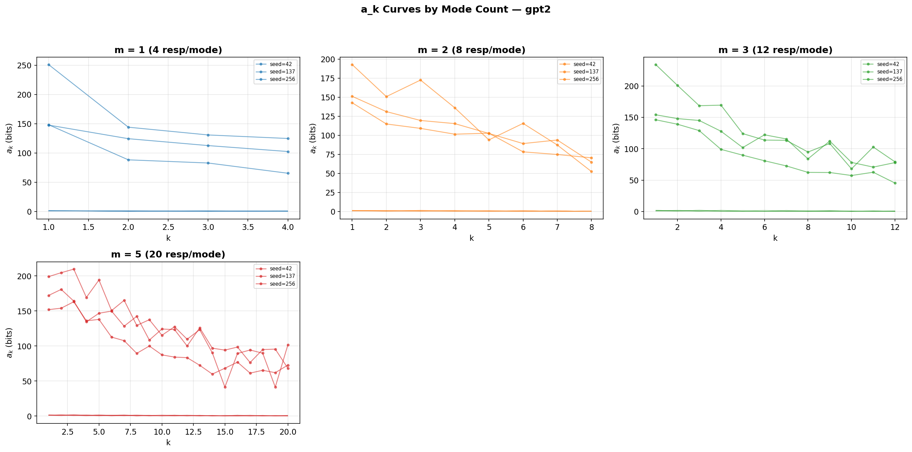
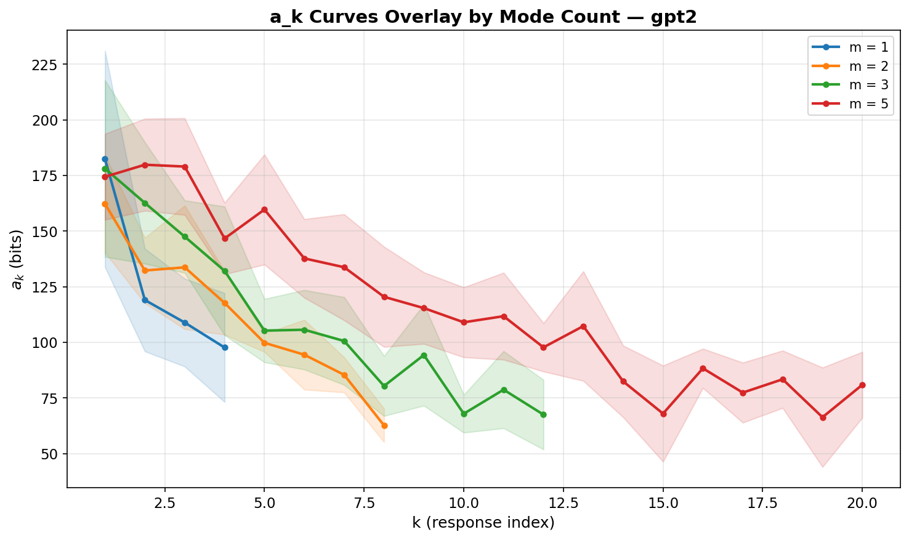
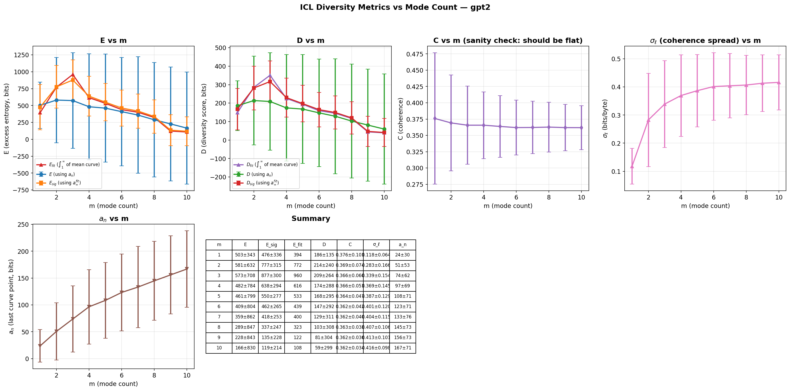
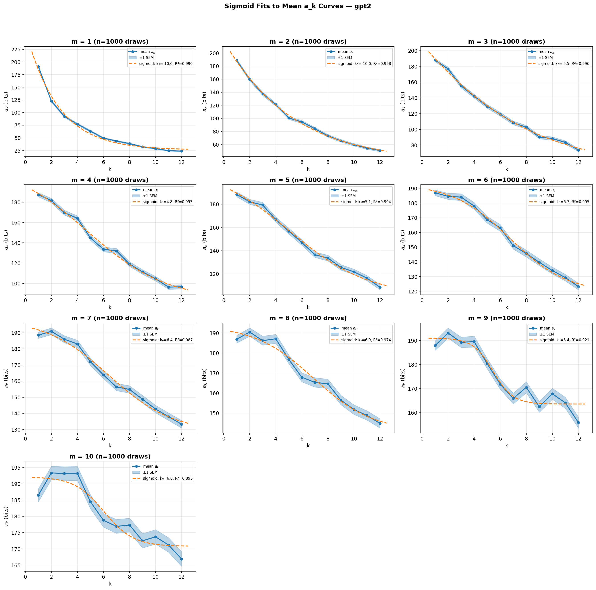
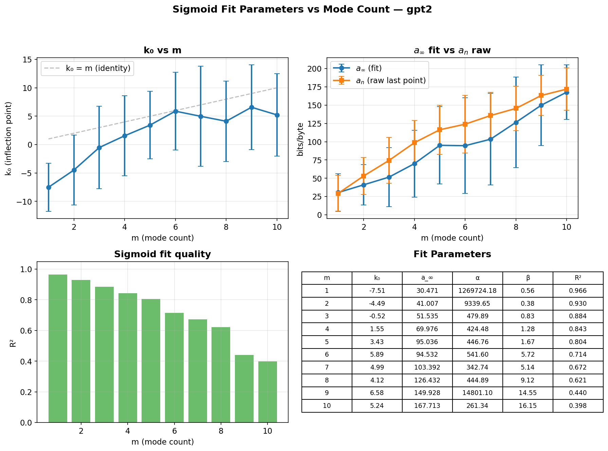

# Mode Count Experiment Report

## Overview

We tested how the number of distinct response modes (m) affects the ICL diversity metric's a_k curve shape and derived quantities (E, C, D). This is the core controlled experiment for the metric: synthetic responses with known mode structure, varying m while holding total response count n fixed.

## Design

- **Modes**: 50 format-based generators (haiku, code, recipe, legal disclaimer, thesis statement, etc.) on the topic "rain"
- **Mode counts**: m ∈ {1, 2, 3, 5, 10}
- **Total responses**: n = 12 (fixed across all m; max that fits GPT-2's 1024-token context for all mode combinations)
- **Permutations**: 20 per seed (each permutation independently selects m random modes and generates n responses, capturing both ordering and mode-selection variance)
- **Seeds**: 3 (42, 137, 256)
- **Base model**: GPT-2

### Key Design Fix

Previous runs used n = m × n_per_mode (e.g., m=1 → 4 responses, m=5 → 20 responses), making curves incomparable due to different x-axis lengths. We fixed n = 12 across all m, so all a_k curves span k = 1..12. This means responses per mode = n/m, which decreases as m grows — an intentional tradeoff that the hypotheses account for.

## Figures

### Per-Panel a_k Curves (`figures/mode_count/ak_curves_by_m.png`)

Per-panel a_k curves for each mode count m ∈ {1, 2, 3, 5, 10}, with n = 12 responses fixed across all m. Each panel shows 3 seeds (colored lines with markers) and 20 per-permutation traces per seed (faint background lines). All curves share the same x-axis (k = 1..12), enabling direct shape comparison. At low m, curves drop steeply from the first response. At high m (e.g., m = 10), curves are flatter — the base model gains less from each additional response because mode coverage per response is lower. Base model: GPT-2 (1024-token context).

### Overlay a_k Curves (`figures/mode_count/ak_curves_overlay.png`)

Overlay of permutation-averaged a_k curves for all m values on shared axes, with ±1 SD bands across 3 seeds. All curves span k = 1..12 (fixed n = 12). Higher m values start at similar a_1 but decay less, resulting in higher asymptotic surprise. The m = 1 curve shows the steepest descent — one mode is fully learnable from few examples. The m = 10 curve remains relatively flat, consistent with the base model seeing too few examples per mode (12/10 ≈ 1.2) to learn any pattern well. Base model: GPT-2.

### Aggregate Metrics (`figures/mode_count/metrics_vs_m.png`)

Aggregate ICL diversity metrics as a function of mode count m. Top row: E (excess entropy, bits), E_rate (bits/byte), and D (diversity score). Bottom row: C (coherence) and a_n (last curve point, approximating a_∞). All metrics are shown with ±1 SD error bars across 3 seeds. E, C, and D all decrease monotonically with m, while a_n increases. This pattern is consistent: more modes with fixed n means fewer responses per mode, reducing the base model's ability to learn inter-response structure (lower E) and predict conditionally (lower C). The summary table provides exact values. Base model: GPT-2, n = 12.

### Sigmoid Fits (`figures/mode_count/sigmoid_fits.png`)

Four-parameter sigmoid fits (a_∞, A, k₀, β) to a_k curves for each (m, seed) combination. Solid lines show data, dashed lines show fits. R² values range from 0.74–0.97. Fits are strong for low m (near-exponential decay captured by sigmoid with k₀ < 0) but weaker for m = 10 where curves are noisy and nearly flat. The sigmoid model captures the concave-up → sigmoidal shape transition predicted by H1, though with n = 12 the sigmoidal regime is only partially observable. Base model: GPT-2.

### Fit Parameters vs m (`figures/mode_count/fit_params_vs_m.png`)

Sigmoid fit parameters as a function of mode count m. k₀ (inflection point) increases with m, consistent with H4 — more modes delay the onset of diminishing returns. Fitted a_∞ increases with m (H3 supported). The amplitude parameter A decreases with m, reflecting the shrinking gap between initial and asymptotic surprise. β (steepness) is variable, reflecting the difficulty of fitting a steep transition when n is small relative to m. Error bars show ±1 SD across 3 seeds. Base model: GPT-2.

## Results

| m | E (bits) | C | D | a_n (bits) |
|---|----------|---|---|------------|
| 1 | 174 ± 15 | 0.845 ± 0.056 | 148 ± 21 | 27 ± 5 |
| 2 | 151 ± 4 | 0.735 ± 0.020 | 111 ± 4 | 55 ± 5 |
| 3 | 125 ± 9 | 0.606 ± 0.032 | 76 ± 9 | 81 ± 7 |
| 5 | 106 ± 13 | 0.512 ± 0.043 | 55 ± 12 | 100 ± 5 |
| 10 | 85 ± 20 | 0.415 ± 0.104 | 37 ± 19 | 121 ± 9 |

## Hypothesis Evaluation

**H1 (Curve Shape Transition): Partially supported.** Low-m curves show steep exponential-like decay. High-m curves are flatter. The full sigmoidal shape with a flat initial plateau is not clearly visible, likely because n = 12 is too short relative to m = 10 (only 1.2 responses per mode) to observe the inflection.

**H2 (E Monotonicity): Reversed.** E *decreases* with m. This is the opposite of the prediction but makes sense: with fixed n, more modes means fewer responses per mode. The base model sees ~1 example per mode at m = 10, which is insufficient to learn any pattern. The "learnable structure" (E) requires repeated examples from the same mode.

**H3 (Asymptote Rises with m): Supported.** a_n increases monotonically from ~27 bits (m=1) to ~121 bits (m=10). More modes → higher residual surprise even after full conditioning.

**H4 (Sigmoid Inflection Point): Partially supported.** Fitted k₀ increases with m, as predicted. At m = 10, k₀ ≈ 10–12, near the edge of the data (n = 12), suggesting the sigmoid is not fully resolved.

**H5 (Extrapolation Quality): Inconclusive.** Would require higher-n runs for ground truth a_∞ comparison.

**H6 (Sign Consistency): Falsified.** E decreases (not increases) with m. The metric measures *learnable redundancy*, not diversity directly. With fixed n, increasing m dilutes per-mode signal, reducing what the base model can learn. This confirms that E is inversely related to diversity — consistent with the Tevet validation finding.

## Interpretation

The results clarify what the ICL diversity metric actually measures: **inter-response predictability under the base model**. When responses are drawn from few modes (low m), each new response is partially predictable from prior responses in the same mode — high E, high C. When responses are drawn from many modes (high m), each response is essentially unpredictable from context — low E, low C.

This means **D decreases with diversity**, which is by design (D = C × E measures learnable structure, not diversity per se). To use D as a diversity metric, one reports it as an inverse measure: lower D = higher diversity.

## Limitations

- **n = 12 is small**: GPT-2's 1024-token context limits n. Larger models (Qwen 2.5-32B with 32K context) would allow n = 20+ and better curve resolution, especially for high m.
- **Mode quality varies**: Some modes (thesis statements) are much longer than others (fortune cookies), creating per-mode token count variance.
- **m = 10 is noisy**: With only 1.2 responses per mode, per-permutation variance is high (visible in the wide error bars).

## Next Steps

1. Run with Qwen 2.5-32B (n = 20, m up to 25) for better curve resolution
2. Test whether E's relationship to m reverses with larger n/m ratios (e.g., n = 100, m = 1..20)
3. Compare sigmoid-extrapolated a_∞ against empirical values from high-n runs
