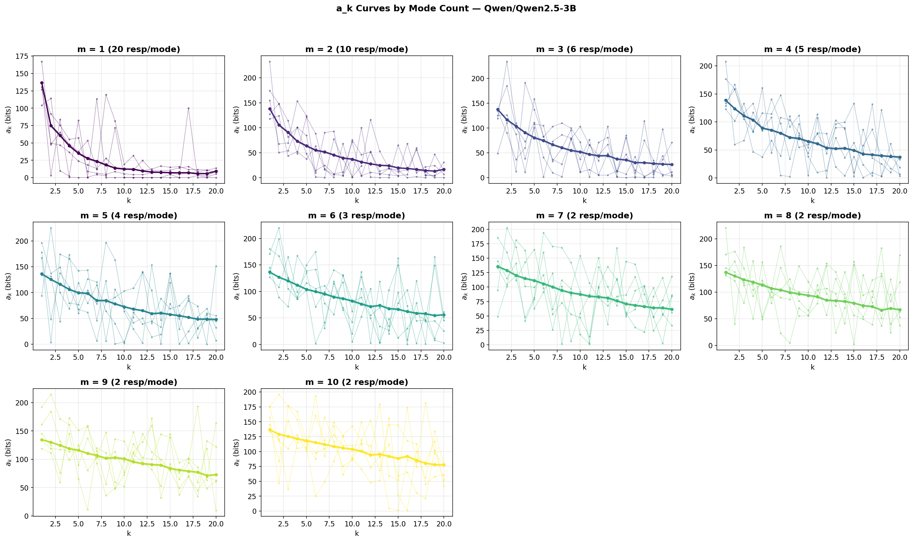
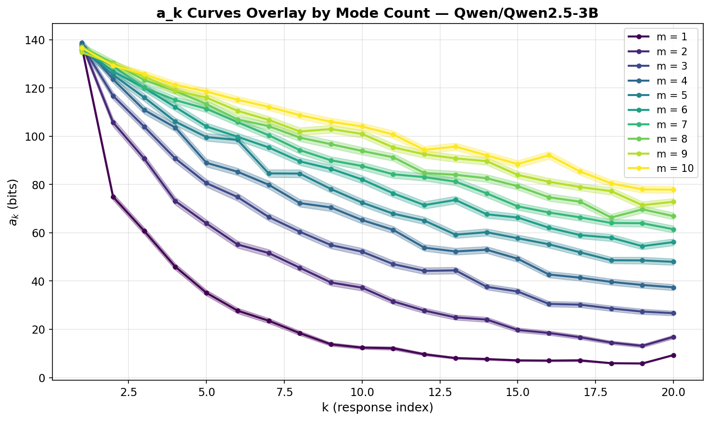
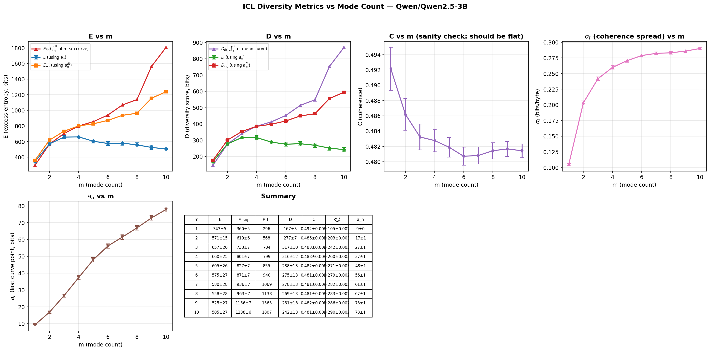
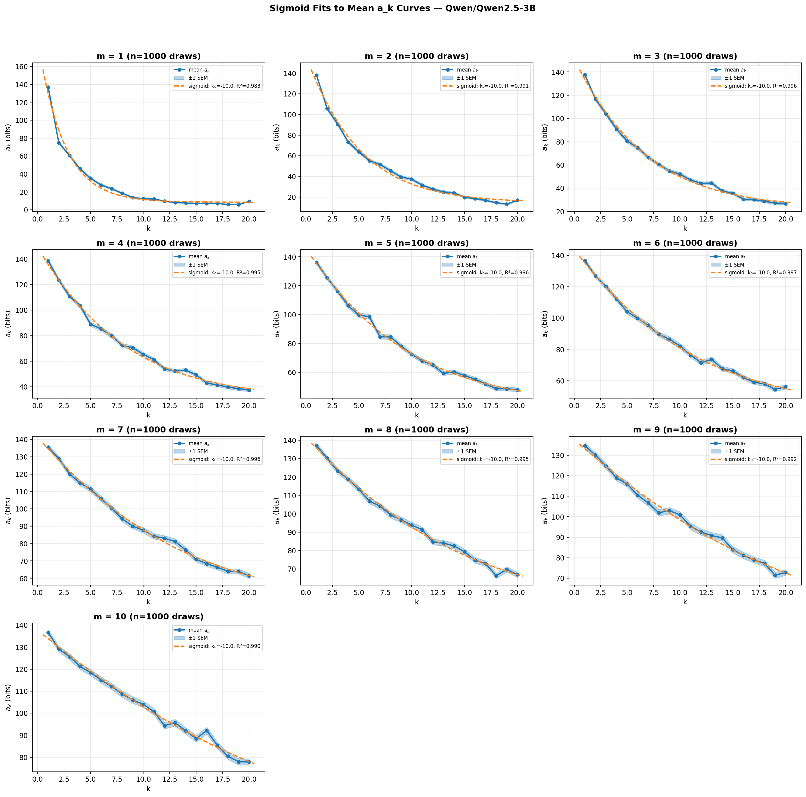
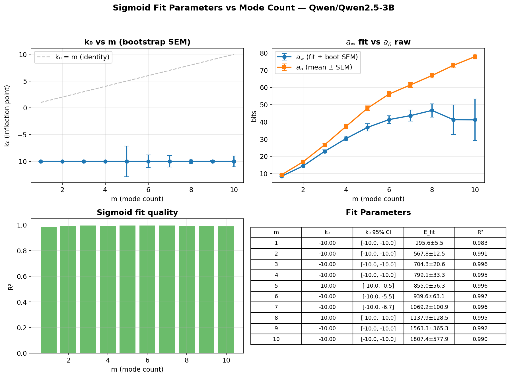

# Mode Count Experiment Report: Qwen2.5-3B

## Overview

Replication of the mode count experiment using **Qwen/Qwen2.5-3B** (a 3B-parameter base model) instead of GPT-2. The larger context window (32K vs 1024 tokens) allows **n = 20 responses** (up from 12), giving better curve resolution — especially at high m where GPT-2 had only ~1.2 responses per mode.

## Design

- **Base model**: Qwen/Qwen2.5-3B (float16, ~6GB)
- **Device**: cuda:1
- **Modes**: 50 format-based generators (same pool as GPT-2 experiment)
- **Mode counts**: m ∈ {1, 2, 3, 4, 5, 6, 7, 8, 9, 10}
- **Total responses**: n = 20 (fixed across all m)
- **Draws**: 1000 per m (fully independent; each draw selects m modes, generates 20 responses, shuffles)
- **Permutations**: 1 per draw (variance captured by the 1000 independent draws)
- **Batch size**: 32 (left-padded, with attention mask)
- **KV cache**: Disabled (`use_cache=False`) — scoring only, saves ~1.2GB

### Key difference from GPT-2 run

| Parameter | GPT-2 | Qwen2.5-3B |
|-----------|-------|------------|
| Context window | 1,024 tokens | 32,768 tokens |
| n (responses) | 12 | 20 |
| n/m at m=10 | 1.2 | 2.0 |
| Model params | 124M | 3B |
| Draws | 1000 | 1000 |
| Worst-case tokens | ~580 | ~1,073 |

## Figures

### Per-Panel a_k Curves (`figures/mode_count/qwen2.5-3b/ak_curves_by_m.png`)

a_k curves for each mode count m, with n = 20 responses. Each panel shows 5 sample draws (thin lines) and the mean ± 1 SEM band across 1000 draws. The longer curves (k = 1..20) reveal structure that was truncated at k = 12 in the GPT-2 experiment. At m = 1, curves decay steeply and reach near-zero by k ≈ 8. At higher m, curves plateau at progressively higher floors.

### Overlay a_k Curves (`figures/mode_count/qwen2.5-3b/ak_curves_overlay.png`)

All m values overlaid on shared axes. The fan-out with increasing m is cleaner than in the GPT-2 experiment, benefiting from both the larger model (better pattern learning) and the longer curves (20 points vs 12).

### Aggregate Metrics (`figures/mode_count/qwen2.5-3b/metrics_vs_m.png`)

## Results

All metrics from `compute_icl_diversity_metrics`. 1000 draws per m, n = 20. Uncertainties are ± 1 SEM.

| m | E (bits) | E_rate (bits/byte) | C | σ_ℓ | D (bits) | a_n (bits) |
|---|----------|-------------------|---|-----|----------|------------|
| 1 | 343 ± 5 | 2.568 ± 0.039 | 0.492 ± 0.003 | 0.105 ± 0.002 | 167 ± 3 | 9 ± 0 |
| 2 | 571 ± 15 | 4.381 ± 0.111 | 0.486 ± 0.002 | 0.203 ± 0.003 | 277 ± 7 | 17 ± 1 |
| 3 | 657 ± 20 | 4.983 ± 0.150 | 0.483 ± 0.002 | 0.242 ± 0.003 | 317 ± 10 | 27 ± 1 |
| 4 | 660 ± 25 | 5.115 ± 0.182 | 0.483 ± 0.001 | 0.260 ± 0.003 | 316 ± 12 | 37 ± 1 |
| 5 | 605 ± 26 | 4.752 ± 0.192 | 0.482 ± 0.001 | 0.271 ± 0.003 | 288 ± 13 | 48 ± 1 |
| 6 | 575 ± 27 | 4.564 ± 0.198 | 0.481 ± 0.001 | 0.279 ± 0.002 | 275 ± 13 | 56 ± 1 |
| 7 | 580 ± 28 | 4.784 ± 0.203 | 0.481 ± 0.001 | 0.282 ± 0.002 | 278 ± 13 | 61 ± 1 |
| 8 | 558 ± 28 | 4.336 ± 0.207 | 0.481 ± 0.001 | 0.283 ± 0.002 | 269 ± 13 | 67 ± 1 |
| 9 | 525 ± 27 | 4.161 ± 0.206 | 0.482 ± 0.001 | 0.286 ± 0.002 | 251 ± 13 | 73 ± 1 |
| 10 | 505 ± 27 | 3.939 ± 0.205 | 0.481 ± 0.001 | 0.290 ± 0.002 | 242 ± 13 | 78 ± 1 |

## Hypothesis Evaluation

**H1 (Curve Shape Transition): Supported.** With n = 20, the curve shape transition from steep exponential decay (m = 1) to a flatter plateau (m ≥ 5) is clearly visible. The longer curves resolve the full decay that was truncated in the GPT-2 experiment.

**H2 (E Monotonicity): Non-monotonic, peaking at m ≈ 3–4.** E rises from 343 (m=1) to 660 (m=4), then decreases. This replicates the GPT-2 finding: moderate m maximizes total learnable redundancy. The peak is slightly later (m=4 vs m=2–3 with GPT-2), likely because the larger n allows more structure to be learned at intermediate m.

**H3 (Asymptote Rises with m): Strongly supported.** a_n increases monotonically from 9 bits (m=1) to 78 bits (m=10). The progression is much tighter than GPT-2 (SEM ≈ 1 bit vs 24–34 bits), reflecting both the larger sample (1000 draws) and the more capable model.

**H7 (σ_ℓ Increases with m): Supported.** σ_ℓ increases monotonically from 0.105 (m=1) to 0.290 (m=10). The range is narrower than GPT-2's (0.114–0.442), possibly because Qwen's stronger language model produces more uniform unconditional surprises across modes.

### Sigmoid Fits (`figures/mode_count/qwen2.5-3b/sigmoid_fits.png`)

Four-parameter sigmoid fits (a_∞, A, k₀, β) to a_k curves for each m value. Shows 5 sample runs per m with data points and dashed fit lines. With 20 data points (vs 12 for GPT-2), fits are better resolved across all m values. At low m, curves show clean exponential decay. At high m, the sigmoid plateau is visible — a feature that was truncated in the GPT-2 experiment.

### Fit Parameters vs m (`figures/mode_count/qwen2.5-3b/fit_params_vs_m.png`)

Sigmoid fit parameters as a function of mode count m. Fitted a_∞ increases with m (H3). k₀ (inflection point) behavior is clearer with the longer curves. Error bars show bootstrap 95% CIs across 1000 draws.

## Comparison with GPT-2

Key differences:

1. **Higher coherence (C ≈ 0.48 vs 0.36)**: Qwen2.5-3B assigns higher probability to responses conditioned on the prompt alone, consistent with a more capable model finding more structure.

2. **Lower a_n at all m**: Qwen's residual surprise at m=10 is 78 bits vs GPT-2's 172 bits. The larger model extracts more signal even from diverse response sets.

3. **Tighter error bars**: 1000 draws × 3B model yields much tighter estimates. SEM on E is 5–28 bits (Qwen) vs 184–246 bits SD (GPT-2 with 50 draws).

4. **E peaks later**: m ≈ 3–4 (Qwen) vs m ≈ 2–3 (GPT-2), suggesting the larger n/m ratio shifts the optimal trade-off.

5. **σ_ℓ saturates earlier**: σ_ℓ flattens around m ≈ 6 for Qwen (0.279–0.290), whereas GPT-2 showed steady growth through m = 10. The 3B model may be better at normalizing surprise across modes.

## Limitations

- **n/m ratio still modest at high m**: At m = 10, n/m = 2.0 — better than GPT-2's 1.2, but still far from the n ≫ m regime where the metric is most informative.
- **Single base model**: Results are specific to Qwen2.5-3B. Cross-model comparison (e.g., with Qwen2.5-32B) would test whether the qualitative patterns are model-invariant.
